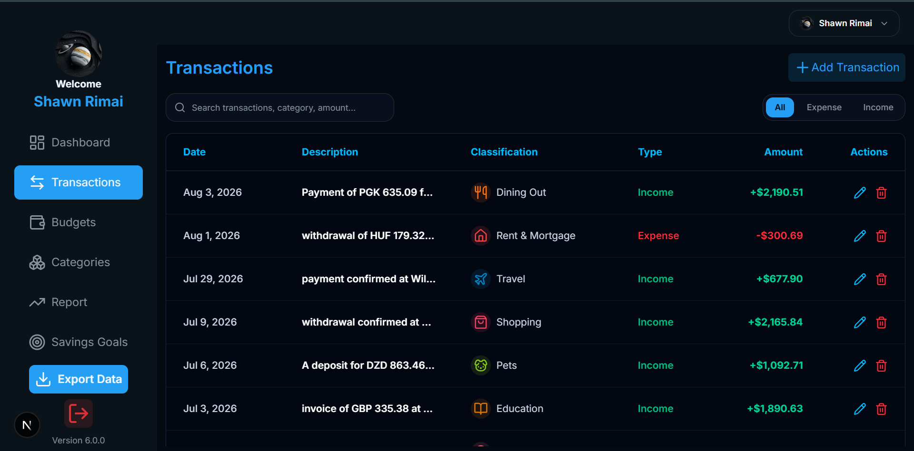

#  Cash Canopy

<div align="center">

### Take Control of Your Money. Grow Your Financial Future.

A modern full-stack personal finance platform designed to help users **track spending, manage budgets, monitor financial goals, and understand their financial habits through meaningful insights.**

<br />

[](https://nextjs.org/)
[](https://www.typescriptlang.org/)
[](https://tailwindcss.com/)
[](https://orm.drizzle.team/)
[](https://neon.tech/)

<br />

<a href="https://cashcanopy.dev/">
  
</a>
<a href="https://github.com/ShawnR04/cash-canopy-v6/issues">
  
</a>
<a href="https://github.com/ShawnR04/cash-canopy-v6/issues">
  
</a>

</div>

<br />

---

##  About Cash Canopy

**Cash Canopy** is a modern personal finance platform built to make managing money simpler, clearer, and more insightful.

The application gives users a centralized place to manage their financial activity. From recording transactions and organizing spending to tracking budgets and financial goals, Cash Canopy helps turn everyday financial data into information that is easier to understand.

Rather than simply storing numbers, Cash Canopy helps users see the bigger picture behind their finances.

### Built With a Focus On

<table>
<tr>
<td align="center" width="20%">
<br /><br />
<b>Performance</b>
</td>
<td align="center" width="20%">
<br /><br />
<b>Clean Code</b>
</td>
<td align="center" width="20%">
<br /><br />
<b>Reliability</b>
</td>
<td align="center" width="20%">
<br /><br />
<b>Insights</b>
</td>
<td align="center" width="20%">
<br /><br />
<b>User Experience</b>
</td>
</tr>
</table>

<br />

> **Your money tells a story. Cash Canopy helps you understand it.**

---

#  Features

<div align="center">

<table>
<tr>

<td align="center" width="33%" valign="top">


### Smart Dashboard

View your financial activity in one place.

Track income, expenses, recent activity, spending categories, and financial trends.

</td>

<td align="center" width="33%" valign="top">


### Transaction Management

Manage your financial activity with ease.

Add, edit, delete, and organize transactions while keeping track of both income and expenses.

</td>

<td align="center" width="33%" valign="top">


### Smart Categories

Organize transactions into meaningful categories.

Understand where your money is going and identify your biggest areas of spending.

</td>

</tr>

<tr>

<td align="center" width="33%" valign="top">


### Budget Tracking

Create budgets and set spending limits.

Monitor your progress and see when your spending requires attention.

</td>

<td align="center" width="33%" valign="top">


### Goals & Milestones

Set financial goals and monitor your progress.

Stay motivated as you work toward important financial milestones.

</td>

<td align="center" width="33%" valign="top">


### Reports & Insights

Turn your financial activity into useful insights.

Explore spending patterns, trends, historical activity, and financial performance.

</td>

</tr>

<tr>

<td align="center" width="33%" valign="top">


### Export Data

Export your financial information for personal records, analysis, and documentation.

</td>

<td align="center" width="33%" valign="top">


### Personalized Experience

Each user has access to their own financial data, including transactions, budgets, categories, goals, reports, and profile information.

</td>

<td align="center" width="33%" valign="top">


### Secure Data Access

Financial data is structured around individual users to support a personalized and protected experience.

</td>

</tr>
</table>

</div>

---

#  Tech Stack

<div align="center">

| Technology                                                                                            | Purpose                            |
| :---------------------------------------------------------------------------------------------------- | :--------------------------------- |
|  **Next.js**                            | Full-stack React framework         |
|  **React**                           | User interface development         |
|  **TypeScript**                 | Type-safe application development  |
|  **Tailwind CSS**              | Responsive styling                 |
|  **Drizzle ORM**                   | Type-safe ORM and database toolkit |
|  **Neon PostgreSQL**                  | Serverless PostgreSQL database     |
|  **shadcn/ui**                    | Reusable interface components      |
|  **Lucide React** | Icon library                       |
|  **Sonner**        | Toast notifications                |
|  **Chart.js**                   | Financial data visualization       |
|  **React Email**                     | Email templates                    |
|  **Vercel**                                | Application deployment             |

</div>

---

#  Project Structure

```text
cash-canopy-v6/
│
├── app/                    # Next.js App Router pages and routes
│   ├── dashboard/          # Dashboard pages and functionality
│   ├── actions/            # Server actions
│   └── ...
│
├── components/             # Reusable React components
│   ├── ui/                 # Reusable UI components
│   └── ...
│
├── db/                     # Database schema and configuration
│
├── drizzle/                # Database migrations
│
├── emails/                 # Email templates
│
├── lib/                    # Shared utilities and application logic
│
├── public/                 # Static assets
│
├── drizzle.config.ts       # Drizzle configuration
├── next.config.ts          # Next.js configuration
├── package.json            # Project dependencies
└── tsconfig.json           # TypeScript configuration
```

---

#  Getting Started

Follow these steps to run Cash Canopy locally.

###  1. Clone the Repository

```bash
git clone https://github.com/ShawnR04/cash-canopy-v6.git
cd cash-canopy-v6
```

###  2. Install Dependencies

```bash
npm install
```

###  3. Configure Environment Variables

Create a `.env.local` file in the root of the project.

```env
DATABASE_URL=your_neon_postgresql_connection_string
```

Add any additional environment variables required for authentication, email services, or other integrations used by your application.

>  **Never commit `.env.local` files or secret keys to GitHub.**

###  4. Configure the Database

Generate your Drizzle migrations:

```bash
npx drizzle-kit generate
```

Apply the migrations to your Neon PostgreSQL database:

```bash
npx drizzle-kit migrate
```

###  5. Start the Development Server

```bash
npm run dev
```

Open:

```text
http://localhost:3000
```

Your local instance of Cash Canopy should now be running.

---

#  Application Preview

<div align="center">

###  Dashboard


<br /><br />

###  Transactions



<br /><br />

###  Budgets


<br /><br />

###  Reports


</div>

---

#  Why Cash Canopy?

Managing finances is about more than recording transactions.

Cash Canopy is designed around a simple process:

<div align="center">

### Record → Organize → Understand → Improve

<br />

<table>
<tr>

<td align="center">
<br />
<b>Your Money</b>
</td>

<td align="center"><b>→</b></td>

<td align="center">
<br />
<b>Transactions</b>
</td>

<td align="center"><b>→</b></td>

<td align="center">
<br />
<b>Categories</b>
</td>

<td align="center"><b>→</b></td>

<td align="center">
<br />
<b>Insights</b>
</td>

<td align="center"><b>→</b></td>

<td align="center">
<br />
<b>Goals</b>
</td>

</tr>
</table>

</div>

<br />

> **The goal is simple: help users make better financial decisions by making their financial data easier to understand.**

---

#  Data & Privacy

Cash Canopy is built around user-specific financial information.

Users interact with their own financial data, including transactions, categories, budgets, goals, reports, and other account-related information.

When deploying your own version of Cash Canopy:

*  Secure environment variables
*  Never expose database credentials
*  Implement proper authentication
*  Validate user input
*  Authorize database operations
*  Ensure users can only access their own information

---

#  Roadmap

Future improvements planned for Cash Canopy include:

* [ ] Advanced financial analytics
* [ ] Recurring transactions
* [ ] More detailed budgeting tools
* [ ] Improved goal tracking
* [ ] CSV transaction imports
* [ ] Additional export formats
* [ ] Financial notifications and reminders
* [ ] Enhanced dashboard customization
* [ ] Dark mode improvements
* [ ] Mobile experience enhancements
* [ ] Advanced reports
* [ ] Automated spending insights

---

#  Contributing

Contributions, suggestions, and improvements are welcome.

1. Fork the repository.
2. Create a feature branch.

```bash
git checkout -b feature/amazing-feature
```

3. Make your changes.
4. Commit your changes.

```bash
git commit -m "Add amazing feature"
```

5. Push your branch.

```bash
git push origin feature/amazing-feature
```

6. Open a Pull Request.

---

#  Found a Bug?

Found an issue?

<a href="https://github.com/ShawnR04/cash-canopy-v6/issues">
  
</a>

When reporting a bug, please include:

* A clear description of the problem
* Steps to reproduce the issue
* Expected behavior
* Actual behavior
* Screenshots, where applicable

---

#  Feature Requests

Have an idea for Cash Canopy?

<a href="https://github.com/ShawnR04/cash-canopy-v6/issues">
  
</a>

Include:

* The feature you would like to see
* The problem it would solve
* Any examples, designs, or mockups

---

#  Live Application

<div align="center">

### Try Cash Canopy

<a href="https://cashcanopy.dev/">
  
</a>

<br /><br />

### Track smarter. Spend wiser. Grow stronger.

</div>

---

#  Author

<div align="center">

## Shawn Rimai

**Computer Science Student · Full-Stack Developer**

<a href="https://github.com/ShawnR04">
  
</a>

</div>

---

<div align="center">


## Cash Canopy

### Your finances. Clearer. Smarter. Better organized.

<br />

**If you like the project, consider giving the repository a star.**

<br /><br />

<sub>Built with modern web technologies and designed to make personal finance easier to understand.</sub>

</div>
