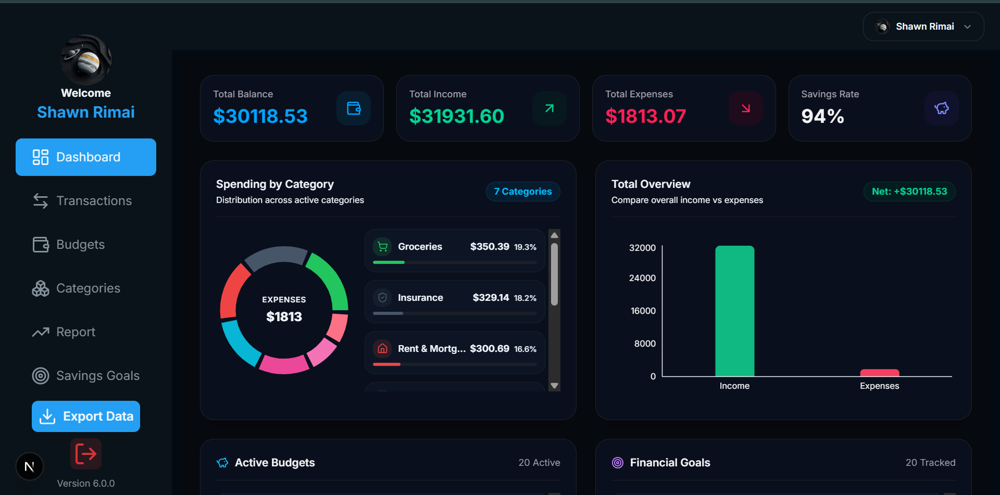
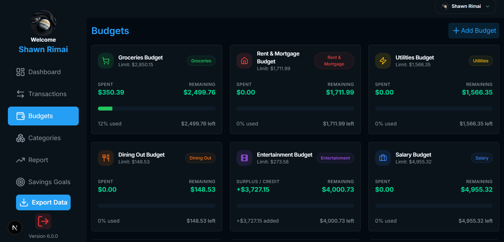
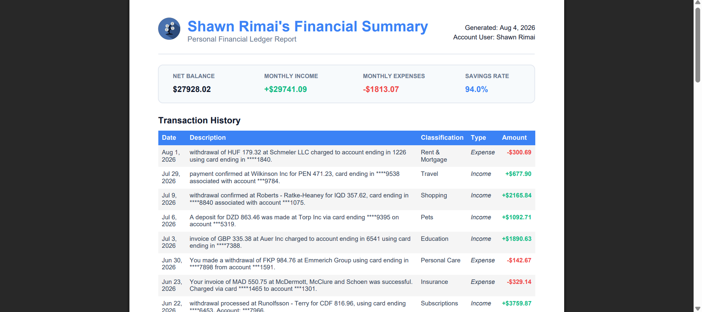

#  Cash Canopy

<div align="center">

### Take Control of Your Money. Grow Your Financial Future.

A modern, high-performance personal finance platform built to help users **track spending, manage budgets, monitor financial goals, and understand their money through meaningful insights**.

<br />

[](https://nextjs.org/)
[](https://www.typescriptlang.org/)
[](https://tailwindcss.com/)
[](https://orm.drizzle.team/)
[](https://turso.tech/)

<br />

<a href="https://cashcanopy.dev/">
  
</a>
<a href="https://github.com/ShawnR04/cash-canopy-v6/issues">
  
</a>
<a href="https://github.com/ShawnR04/cash-canopy-v6/issues">
  
</a>

</div>

<br />

---

##  About The Project

**Cash Canopy** is a high-performance, full-stack personal finance platform engineered to give users greater control over their financial health.

By combining data visualization, transaction categorization, budget tracking, and milestone tracking, Cash Canopy transforms financial data into actionable insights through a fast, responsive, and polished user experience.

Managing money shouldn't require complicated spreadsheets or confusing financial software. Cash Canopy provides a clean and intuitive experience where users can organize transactions, track spending, manage budgets, monitor financial progress, and gain a better understanding of their financial habits.

### Built With a Focus On

<table>
<tr>
<td align="center" width="20%">
<br />
<b>Performance</b>
</td>
<td align="center" width="20%">
<br />
<b>Clean Code</b>
</td>
<td align="center" width="20%">
<br />
<b>Stability</b>
</td>
<td align="center" width="20%">
<br />
<b>Insights</b>
</td>
<td align="center" width="20%">
<br />
<b>Great UX</b>
</td>
</tr>
</table>

> **Your money tells a story. Cash Canopy helps you understand it.**

---

#  Features

<div align="center">

<table>
<tr>

<td align="center" width="33%" valign="top">


### Smart Dashboard

Get an instant overview of your financial activity.

Track income, expenses, recent activity, category spending, and financial trends in one place.

</td>

<td align="center" width="33%" valign="top">


### Transactions

Add, edit, delete, and organize your financial activity.

Keep track of income and expenses with dates, descriptions, and categories.

</td>

<td align="center" width="33%" valign="top">


### Categories

Organize spending into meaningful categories.

Understand exactly where your money is going.

</td>

</tr>

<tr>

<td align="center" width="33%" valign="top">


### Budget Tracking

Create budgets, set spending limits, and monitor your progress.

Know when your spending needs attention.

</td>

<td align="center" width="33%" valign="top">


### Goals & Milestones

Set financial targets and track your progress.

Stay motivated as you work toward important milestones.

</td>

<td align="center" width="33%" valign="top">


### Reports & Insights

Transform your financial data into useful information.

Understand spending patterns, trends, and historical activity.

</td>

</tr>

<tr>

<td align="center" width="33%" valign="top">


### Export Your Data

Export your financial information for record keeping, analysis, and personal documentation.

</td>

<td align="center" width="33%" valign="top">


### Personalized Experience

Every user has access to their own transactions, budgets, categories, goals, reports, and profile data.

</td>

<td align="center" width="33%" valign="top">


### User-Focused Data

Your financial experience is structured around your own data and activity.

</td>

</tr>
</table>

</div>

---

#  Built With

<div align="center">

| Technology                                                                            | Purpose                           |
| :------------------------------------------------------------------------------------ | :-------------------------------- |
|  **Next.js**            | Full-stack React framework        |
|  **React**                  | User interface development        |
|  **TypeScript**        | Type-safe application development |
|  **Tailwind CSS**     | Responsive styling                |
|  **Drizzle ORM**          | Type-safe database queries        |
|  **Turso / libSQL**         | Database infrastructure           |
|  **shadcn/ui**           | Reusable UI components            |
|  **Lucide React** | Modern icon library               |
|  **Sonner**        | Toast notifications               |
|  **Chart.js**          | Financial data visualization      |
|  **React Email**            | Transactional email templates     |
|  **Vercel**                | Deployment                        |

</div>

---

#  Project Structure

```text
cash-canopy-v6/
│
├── app/                    # Next.js App Router pages and routes
│   ├── dashboard/          # Dashboard functionality
│   ├── actions/            # Server actions
│   └── ...
│
├── components/             # Reusable React components
│   ├── ui/                 # Reusable UI components
│   └── ...
│
├── db/                     # Database configuration and schema
│
├── drizzle/                # Database migrations
│
├── emails/                 # Email templates
│
├── lib/                    # Utility functions and shared logic
│
├── public/                 # Static assets
│
├── drizzle.config.ts       # Drizzle configuration
├── next.config.ts          # Next.js configuration
├── package.json            # Project dependencies
└── tsconfig.json           # TypeScript configuration
```

---

#  Getting Started

Follow these steps to run Cash Canopy locally.

### 1. Clone the Repository

```bash
git clone https://github.com/ShawnR04/cash-canopy-v6.git
cd cash-canopy-v6
```

### 2. Install Dependencies

```bash
npm install
```

### 3. Configure Environment Variables

Create a `.env.local` file in the root of the project.

```env
TURSO_CONNECTION_URL=your_turso_database_url
TURSO_AUTH_TOKEN=your_turso_auth_token
```

Add any additional environment variables required by your authentication, email, or external services.

>  **Never commit `.env.local` files or secret keys to GitHub.**

### 4. Configure the Database

Generate your Drizzle migrations:

```bash
npx drizzle-kit generate
```

Apply your migrations using the database workflow configured for the project.

### 5. Start the Development Server

```bash
npm run dev
```

Visit:

```text
http://localhost:3000
```

---

#  Application Preview

<div align="center">

###  Dashboard



<br /><br />

###  Transactions


<br /><br />

###  Budgets



<br /><br />

###  Reports



</div>

---

#  Why Cash Canopy?

Most personal finance applications focus on simply recording numbers.

Cash Canopy aims to go further.

<div align="center">

### Record → Organize → Understand → Improve

<br />

<table>
<tr>
<td align="center">

<br /> <b>Your Money</b>

</td>
<td align="center">→</td>
<td align="center">

<br /> <b>Transactions</b>

</td>
<td align="center">→</td>
<td align="center">

<br /> <b>Categories</b>

</td>
<td align="center">→</td>
<td align="center">

<br /> <b>Insights</b>

</td>
<td align="center">→</td>
<td align="center">

<br /> <b>Goals</b>

</td>

</tr>
</table>

</div>

> **The goal is simple: Help users make better financial decisions by making their financial data easier to understand.**

---

#  Data & Privacy

Cash Canopy is designed around user-specific financial data.

Application data is structured so that users interact with their own financial information, including transactions, categories, budgets, goals, and other financial records.

When deploying your own version of Cash Canopy, make sure to:

*  Secure all environment variables
*  Never expose database credentials
*  Implement proper authentication
*  Validate user input
*  Authorize database operations
*  Ensure users can only access their own data

---

#  Future Improvements

Cash Canopy is continuously evolving.

Potential future improvements include:

* [ ] Advanced financial analytics
* [ ] Recurring transactions
* [ ] More detailed budgeting tools
* [ ] Improved goal tracking
* [ ] CSV data import
* [ ] Additional export formats
* [ ] Financial notifications and reminders
* [ ] Enhanced dashboard customization
* [ ] Dark mode improvements
* [ ] Mobile experience enhancements
* [ ] More advanced reports
* [ ] Automated spending insights

---

#  Contributing

Contributions, ideas, and improvements are welcome.

### How to Contribute

1. Fork the repository
2. Create a new branch

```bash
git checkout -b feature/amazing-feature
```

3. Make your changes
4. Commit your changes

```bash
git commit -m "Add amazing feature"
```

5. Push to your branch

```bash
git push origin feature/amazing-feature
```

6. Open a Pull Request

---

#  Found a Bug?

If you find a bug or experience an issue, please open an issue on GitHub.

<a href="https://github.com/ShawnR04/cash-canopy-v6/issues">
  
</a>

Please include:

* A clear description of the problem
* Steps to reproduce it
* Expected behavior
* Actual behavior
* Screenshots, if applicable

---

#  Feature Requests

Have an idea that could make Cash Canopy better?

Feel free to open an issue with:

* A description of the feature
* The problem it solves
* Any examples or mockups

<a href="https://github.com/ShawnR04/cash-canopy-v6/issues">
  
</a>

---

#  Live Application

<div align="center">

### Try Cash Canopy

<a href="https://cashcanopy.dev/">
  
</a>

<br /><br />

**Track smarter. Spend wiser. Grow stronger.**

</div>

---

#  Author

<div align="center">

## Shawn Rimai

**Computer Science Student · Full-Stack Developer**

<a href="https://github.com/ShawnR04">
  
</a>

</div>

---

<div align="center">


## Cash Canopy

### Your finances. Clearer. Smarter. Better organized.

<br />

**If you like the project, consider giving the repository a star.**

<br />

<sub>Built with modern web technologies and a focus on helping people better understand their finances.</sub>

</div>
